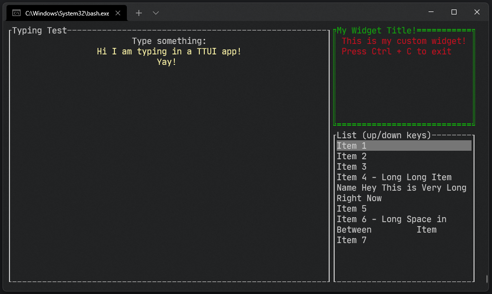

# TTUI - Tiny Terminal User Interface
 A lightweight TUI library for C++11 for Linux.

## Install

1. Clone the repository: `git clone https://github.com/LioQing/ttui`
2. Enter the cloned folder: `cd ttui`
3. Run the make file
   1. Debug build: `make` or `make debug`
   2. Release build: `make release`
   3. Test build: `make test`, `make test_build`, `make test_release` , `make test` and `make test_release` run the executable as well
4. The static library .a file is in the build folder inside the repository folder
